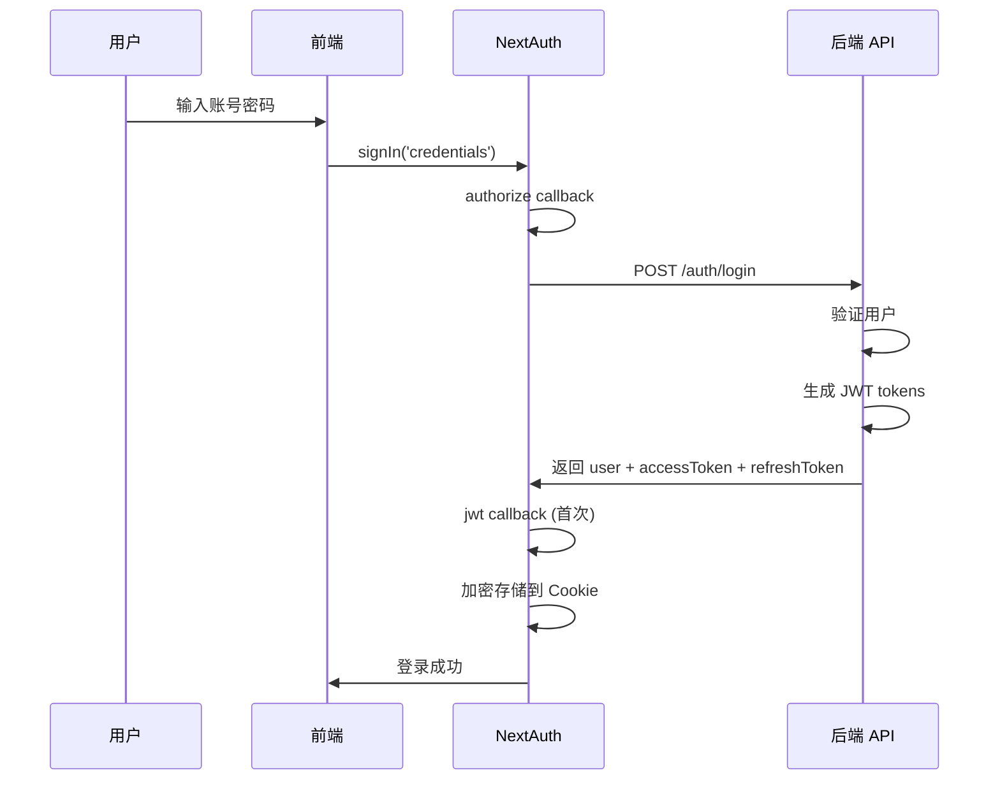
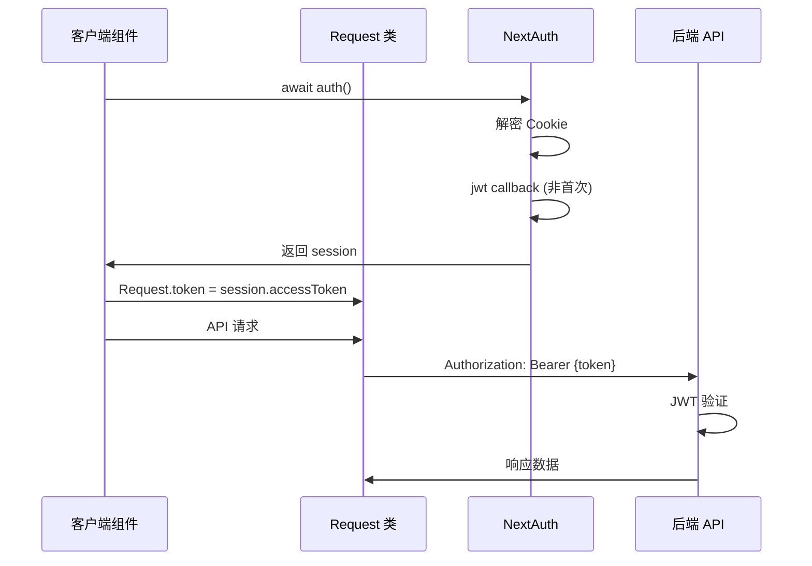

# JWT 鉴权架构文档

## 目录

- [架构概览](#架构概览)
- [完整鉴权流程](#完整鉴权流程)
- [Token 管理机制](#token-管理机制)
- [当前架构问题](#当前架构问题)
- [优化建议](#优化建议)
- [常见问题](#常见问题)

## 架构概览

本项目采用 **NextAuth + 后端 JWT** 的混合鉴权架构：

- **后端 (NestJS)**: 生成和验证 JWT tokens
- **前端 (NextAuth)**: 管理登录流程和 session 存储
- **鉴权方式**: Bearer Token (后端生成的 JWT)

### 核心组件

```
┌─────────────────┐    ┌─────────────────┐    ┌─────────────────┐
│   前端页面      │    │   NextAuth      │    │   后端 API      │
│                 │    │                 │    │                 │
│ await auth()    │───▶│ 加密 Cookie     │    │ JWT 验证        │
│ Request.token   │    │ session 管理    │    │ Token 生成      │
└─────────────────┘    └─────────────────┘    └─────────────────┘
```

## 完整鉴权流程

### 1. 登录阶段



#### 详细步骤：

1. **用户输入凭据** → 触发 NextAuth `signIn()`
2. **NextAuth Credentials Provider** → 调用 `authorize` 函数
3. **authorize 函数** → 请求后端 `/auth/login` API
4. **后端生成 Tokens**:
   ```typescript
   // apps/api/src/auth/auth.service.ts
   const accessToken = this.jwtService.sign(payload); // 1小时过期
   const refreshToken = this.jwtService.sign(payload, { expiresIn: '7d' }); // 7天过期
   ```
5. **NextAuth JWT Callback** → 处理返回的用户数据
6. **加密存储** → 将 tokens 加密存储到 Cookie

### 2. 请求验证阶段



### 3. Token 刷新阶段

```typescript
// apps/web/lib/auth.ts - jwt callback
if (Date.now() / 1000 > token.exp - 30 && token.refreshToken) {
  // 距离过期还有30秒时自动刷新
  const res = await Request.post('/auth/refresh-token', {
    refreshToken: token.refreshToken,
  });

  return {
    ...token,
    accessToken: res.data.accessToken,
    refreshToken: res.data.refreshToken,
    exp: Date.now() / 1000 + expiresIn,
  };
}
```

## Token 管理机制

### 后端 Token 生成 (NestJS)

```typescript
// apps/api/src/auth/auth.service.ts
async login(user: any) {
  const payload = { sub: user.id, email: user.email };

  // Access Token: 1小时过期
  const accessToken = this.jwtService.sign(payload);

  // Refresh Token: 7天过期，存储在 Redis
  const refreshToken = this.jwtService.sign(payload, {
    expiresIn: `${this.expiresIn}d`,
  });

  await this.redisService.set(
    `refresh_token:${user.id}`,
    refreshToken,
    this.expiresIn * 24 * 60 * 60,
  );

  return { ...user, accessToken, refreshToken };
}
```

### 前端 Token 存储 (NextAuth)

```typescript
// NextAuth 自动管理的存储
Cookie: next-auth.session-token = encrypt({
  id: "user123",
  accessToken: "eyJ...",     // 后端生成的 JWT
  refreshToken: "eyJ...",    // 后端生成的 Refresh Token
  exp: 1234567890           // NextAuth 管理的过期时间
}, AUTH_SECRET)
```

### 当前的多重存储问题

```typescript
// 1. NextAuth Cookie (加密)
next-auth.session-token = encrypt(tokenData)

// 2. 内存静态属性
Request.token = session.accessToken

// 3. localStorage (明文)
localStorage.setItem(TOKEN_STORAGE_KEY, session.accessToken)
```

## 当前架构问题

### 1. Token 存储的三重冗余

- **问题**: 同一个 token 被存储在三个不同的地方
- **风险**: 数据不同步，安全性降低
- **影响**: 维护复杂，容易出现 bug

### 2. 获取路径不一致

```typescript
// 业务逻辑中
const session = await auth(); // 从 NextAuth Cookie
const userInfo = session.user;

// API 请求中
Request.token; // 从内存静态属性
```

### 3. token.exp 混乱问题

**问题根源**: NextAuth 的 session 管理与后端 JWT 过期时间不同步

```typescript
// NextAuth 配置
session: {
  maxAge: 3600,           // 1小时 - NextAuth session 过期
  updateAge: 3240,        // 54分钟 - 自动更新频率
}

// 后端 JWT
expiresIn: '1h'           // 1小时 - JWT 真实过期时间
```

**结果**: 每次页面刷新，`token.exp` 可能被 NextAuth 重新计算

### 4. 登出时的清理不完整

```typescript
// NextAuth signOut() 自动清理:
✅ Cookie (next-auth.session-token)
✅ 数据库 Session 记录

// 需要手动清理:
❌ Request.token (内存)
❌ localStorage 中的 token
```

## 优化建议

### 方案1: 完全依赖 NextAuth (推荐)

**优点**:

- 单一数据源，无同步问题
- 自动处理刷新和清理
- 更安全 (加密存储)

**实施步骤**:

1. **移除手动存储**:

   ```typescript
   // 移除这些
   Request.token = session.accessToken;  ❌
   localStorage.setItem(TOKEN_STORAGE_KEY, token);  ❌
   ```

2. **修改 Request 类**:

   ```typescript
   export class Request {
     // 移除静态 token 属性

     static async get(url: string, queryData?: any, options?: any) {
       const session = await auth(); // 每次都获取最新 session

       const isPublic = whiteList.some((path) => url.includes(path));
       if (!isPublic && session?.accessToken) {
         headers['Authorization'] = `Bearer ${session.accessToken}`;
       }

       // 发送请求...
     }
   }
   ```

3. **简化 NextAuth 配置**:

   ```typescript
   export const { handlers, signIn, signOut, auth } = NextAuth({
     providers,
     secret: process.env.AUTH_SECRET,
     // 移除 session 配置，使用默认值 (30天)
     callbacks: {
       async jwt(data) {
         const { token, user } = data;
         if (user) {
           // 使用后端 JWT 的真实过期时间
           const decoded = jwt_decode(user.accessToken);
           token.exp = decoded.exp;
           token.accessToken = user.accessToken;
           token.refreshToken = user.refreshToken;
         }

         // 基于真实过期时间刷新
         if (token.exp && Date.now() / 1000 > token.exp - 30) {
           // 刷新逻辑...
         }
         return token;
       },
     },
   });
   ```

### 方案2: 混合优化 (当前架构修复)

如果暂时不想大改，可以先修复同步问题:

```typescript
// client-layout-wrapper.tsx
useLayoutEffect(() => {
  if (session?.accessToken) {
    Request.token = session.accessToken;
    storage.set(TOKEN_STORAGE_KEY, session.accessToken);
  }
}, [session?.accessToken]); // 添加依赖，响应变化

// 登出时完整清理
const handleLogout = () => {
  Request.token = null; // 清理内存
  storage.remove(TOKEN_STORAGE_KEY); // 清理 localStorage
  await signOut(); // NextAuth 清理
};
```

## 常见问题

### Q: 为什么 token.exp 每次都变？

**A**: NextAuth 的 session 管理机制导致的。NextAuth 根据 `updateAge` 配置定期更新 session，可能重新计算过期时间。

**解决**: 移除 NextAuth 的 session 配置，或使用后端 JWT 的真实过期时间。

### Q: 登出后为什么还能发请求？

**A**: 手动存储的 token 没有被清理。

**解决**:

```typescript
// 登出时清理所有存储
Request.token = null;
localStorage.removeItem(TOKEN_STORAGE_KEY);
await signOut();
```

### Q: 如何确保 token 同步？

**A**: 使用单一数据源 (NextAuth Cookie) 或确保所有存储位置同步更新。

### Q: NextAuth 的安全性如何？

**A**: NextAuth 使用 JWE (加密的 JWT) 存储 session，比明文存储在 localStorage 更安全。

## 环境变量配置

```bash
# 后端 (apps/api-server)
TOKEN_EXPIRES_IN_HOURS=1           # JWT Access Token 过期时间
REFRESH_TOKEN_EXPIRES_IN_DAYS=7    # Refresh Token 过期时间
AUTH_SECRET=your-secret-key        # JWT 签名密钥

# 前端 (apps/admin-web)
AUTH_SECRET=your-secret-key        # NextAuth 加密密钥 (与后端相同)
NEXT_PUBLIC_API_URL=http://localhost:8080  # 后端 API 地址
```

## 总结

当前架构的核心问题是 **数据存储和获取路径的不一致性**。推荐采用 **完全依赖 NextAuth** 的方案，这样可以：

- ✅ 消除数据同步问题
- ✅ 提高安全性
- ✅ 简化维护复杂度
- ✅ 自动处理 token 刷新和清理

---

_文档版本: 1.0_
_最后更新: 2024-09-27_
